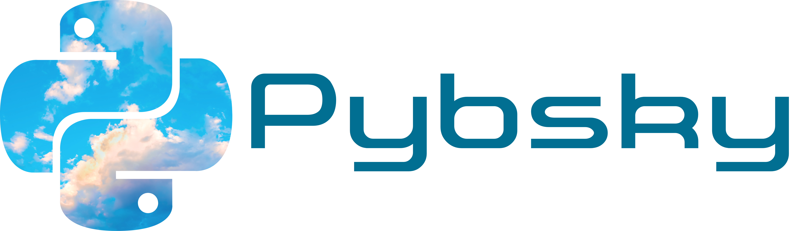

# Pybsky

## TODO List:

- [x] Create Client
- [x] Add Login logic
- [x] Get Profile logic
- [x] Get Follwer/Following logic
- [x] Follow/Unfollow
- [x] Get likes
- [x] Get post, thread via replies
- [x] Get Author Feed/Timeline
- [x] Create post (text and image)

## License

- This project is licensed under the terms of the **[MIT license](LICENSE)**
